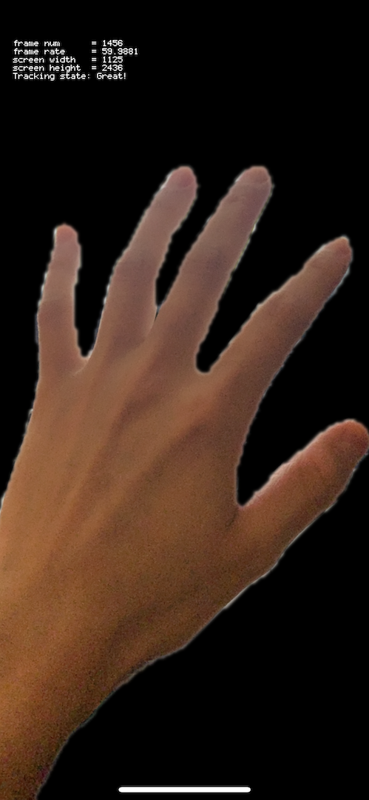
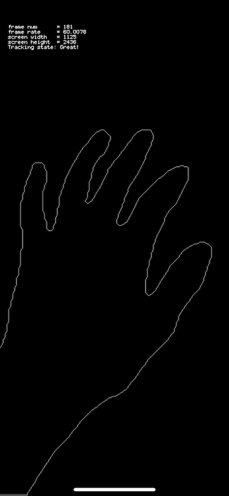
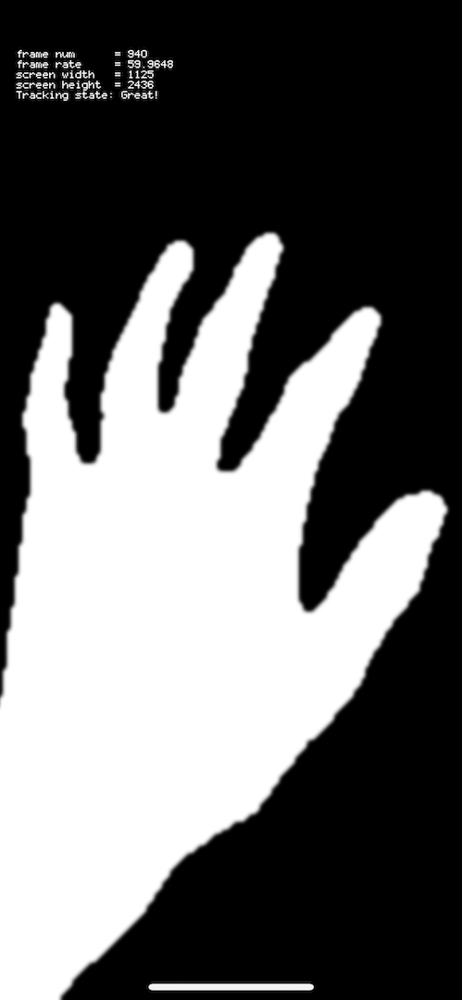
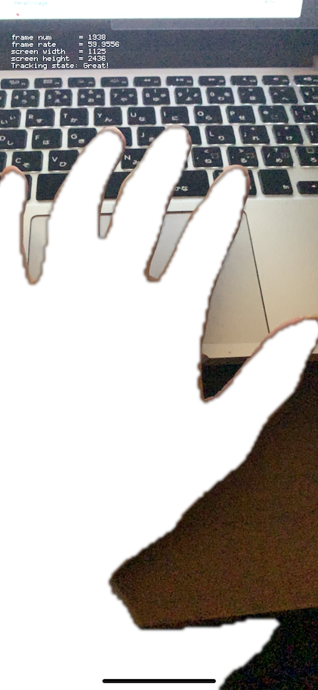

# oF_PeopleOcclusion_example

PeopleOcclusion with openFrameworks.

### Dependencies

- openFrameworks0.11.0 for iOS
- Xcode11.3 ~
- iPhone[A12/A12X Bionic].  (tested on my iPhoneXS)
- ofxAddons
  - ofxARKit
  - ofxOpenCv
  - ofxCv

### how to

coming soon.(Japanese)